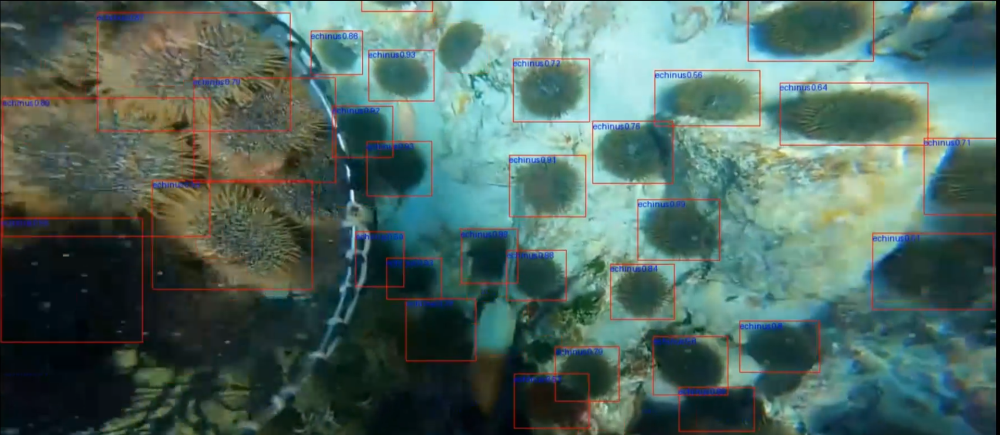
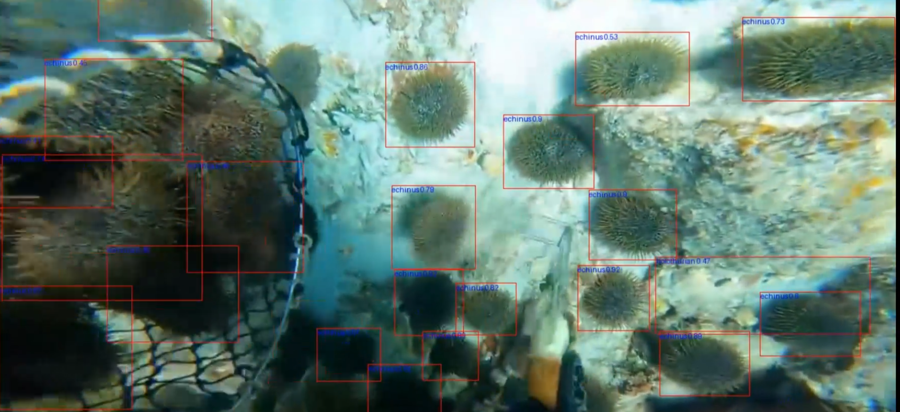
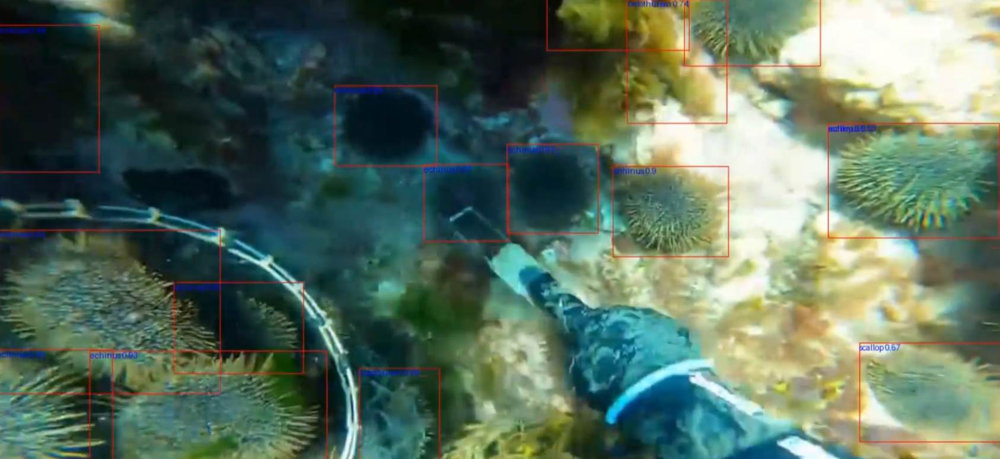

## 🎥 Underwater Video Object Detection Test (DFFR-Net)

To further evaluate the real-world adaptability of the proposed DFFR-Net, we applied the model to real-shot underwater videos for object detection testing. The test does not involve any post-processing such as temporal smoothing; only the raw outputs of the model are used for visualization. Results show that DFFR-Net effectively handles challenges such as lighting variations, background interference, and target deformation in underwater environments, demonstrating strong real-time detection capability and robustness.

* 📹 Video Demo Link:
  👉 \[Click to Watch Underwater Detection Results]\(Link: [https://pan.baidu.com/s/1UxXscTLnDi384-saW1oZUw](https://pan.baidu.com/s/1UxXscTLnDi384-saW1oZUw) Password: y9bj)

* 📌 Test Information:

  * **Model**: DFFR-Net
  * **Video Resolution**: 1280×720
  * **Inference Environment**: All experiments were conducted on a server equipped with 4× NVIDIA Tesla V100S GPUs (32GB memory each) under the CUDA 12.0 environment.
  * **Detection Categories**: Holothurian, Echinus, Scallop, Starfish, etc.
  * **Post-processing**: None

* 📷 Example Screenshot:

Shared via cloud storage: `video detection.mp4`

> 🔧 **Usage Instructions**:
> To test videos locally, refer to the `tools/inference/torch_inf.py` script. You can input any `.mp4` video into the model for prediction and visualization.

